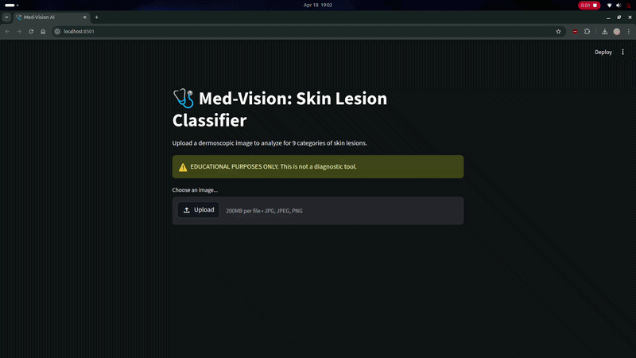

# 🧠 Skin Lesion Classification & Explainable ML System

A production-style machine learning project for **skin lesion classification**, built with a strong focus on:

* 📊 **model performance (Macro F1)**
* 🧪 **controlled experimentation**
* ⚙️ **deployment (FastAPI)**
* ⚡ **optimized inference (ONNX)**

---

## 🚀 Overview

This project classifies dermoscopic images into **9 skin lesion categories** using deep learning.

Unlike typical ML projects, this work emphasizes:

> **“Not just prediction — but understanding, optimization, and deployment.”**

---

### 📺 System Demo


---

## 📊 Final Results

| Experiment                  | Macro F1   |
| --------------------------- | ---------- |
| Baseline (EffNet-B0)        | ~0.46      |
| + Augmentation              | ~0.51      |
| + Class Weights             | ~0.45      |
| + Aug + Weights             | ~0.53      |
| + Scheduler + Resolution    | ~0.586     |
| **Final Model (EffNet-B3)** | **~0.590** |

---

## 🧠 Key Insights

* **Data augmentation** significantly improved generalization
* **Class weighting** improved minority class sensitivity (not overall F1)
* **Scheduler + early stopping** enabled better convergence
* **Higher resolution (300×300)** improved lesion detail capture
* Model performance shows **realistic uncertainty** due to dataset limitations

---

## ⚙️ Tech Stack

* **PyTorch** – model training
* **timm** – EfficientNet architectures
* **scikit-learn** – evaluation metrics
* **FastAPI** – backend API
* **ONNX Runtime** – optimized inference
* **OpenCV / PIL** – image processing

---

## 🏗️ Project Structure

```
skin-lesion-ml/
│
├── src/
│   ├── models/
│   └── data/
│
├── results/                # experiment outputs
│   ├── 01_baseline/
│   ├── 02_augmentation/
│   ├── ...
│   └── 06_final_model/
│
├── app/                    # FastAPI application
│   ├── main.py
│   ├── inference.py
│   ├── ui.py
|
├── scripts/
|   ├── run.py
|
├── notebooks/
├── requirements.txt
└── README.md
```

---

## 🔬 Experiments

This project follows a **research-style workflow**:

```
Baseline → Augmentation → Class Imbalance → Combined → Optimization → Final Model
```

Each experiment includes:

* hypothesis
* metrics
* plots
* observations

👉 This forms a **mini ablation study**

---

## ⚡ Inference System

### FastAPI Endpoint

```
POST /predict
```

**Input:** image file
**Output:**

```json
{
  "prediction": "Melanoma",
  "confidence": 0.448,
  "top_k": [...],
  "heatmap": "gradcam_overlay.png"
}
```

---

## ⚡ ONNX Optimization

The trained PyTorch model is exported to ONNX for:

* faster CPU inference
* reduced latency
* production readiness

---

## 🧠 Model Behavior

The model:

* shows **uncertainty in ambiguous cases**
* distributes probability across similar classes
* avoids overconfident incorrect predictions

👉 This is desirable in real-world medical settings

---

## ⚠️ Limitations

* Small and imbalanced dataset
* High inter-class similarity
* Moderate confidence scores (~0.3–0.6)

---

## 🚀 Future Improvements

* larger dataset / external validation
* better calibration (temperature scaling)
* lightweight model for edge deployment
* GPU inference optimization

---

## 💡 What This Project Demonstrates

* ✔ End-to-end ML pipeline
* ✔ Experimental rigor (ablation studies)
* ✔ Model optimization & tuning
* ✔ Backend deployment (FastAPI)
* ✔ Inference acceleration (ONNX)


---

## 📌 Conclusion

This project evolves from a simple classifier into a **complete ML system**, combining:

* performance
* interpretability
* engineering

> A strong foundation for roles in **ML Engineering, AI Systems, and Model Optimization**

---

## 📎 Author

**Vineet Kumar**

---

## ⭐ If you found this useful

Consider giving a ⭐ to the repo!
